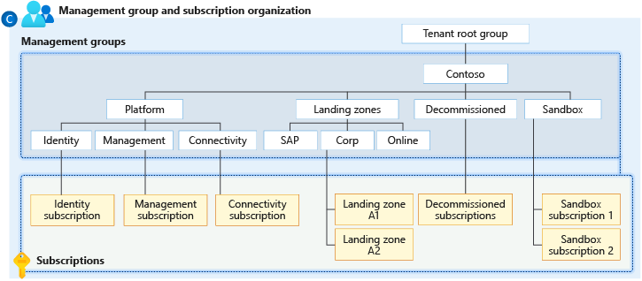

# Cloud Adoption Framework management groups example

This example module will create a management group tree example recommended by Azure Cloud Adoption Framework.



```terraform
module "caf_management_groups" {
  source  = "../../"
  context = module.this.context

  management_groups = {
    contoso = {
      management_groups = {
        platform = {
          management_groups = {
            identity     = {}
            management   = {}
            connectivity = {}
          }
        }
        landing-zones = {
          display_name = "Landing Zones"
          management_groups = {
            sap = {
              display_name = "SAP"
            }
            corp   = {}
            online = {}
          }
        }
        decommissioned = {}
        sandbox        = {}
      }
    }
  }
}
```

## Usage

```shell
terraform init
terraform plan -out tfplan
terraform apply tfplan
```
